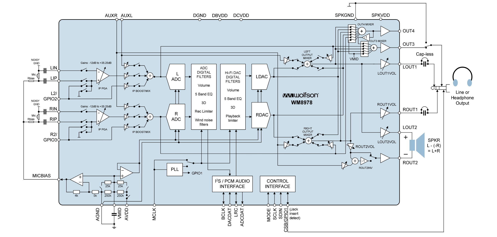
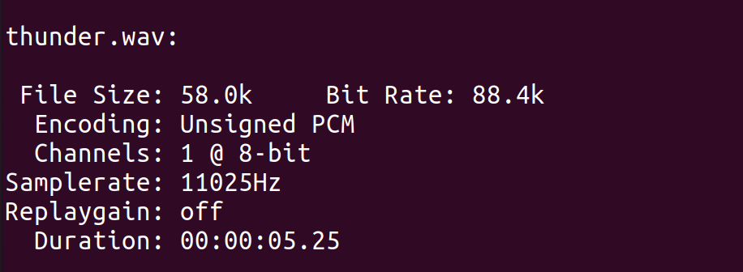

# audio codec

> Audio Codec也就是音频编解码器。内部集成了ADC，DAC转换模块，可以实现回音消除，噪音抵消，以及ALC/Limiter等


外界的声音（模拟信号）通过麦克风进入Audio Codec中，经由ADC模块将模拟信号转换成数字信号后通过IIS接口送给SOC，SOC对这些数字信号加工后再通过IIS接口传输给Audio Codec，由SOC传来的数字信号中经过DAC模块转换成模拟信号送到耳机或者喇叭放出声音。（另外Audio Codec的控制器是通过IIC进行配置的）下图是音频编码器WM8978的结构示意图。



### 1.音频基本概念

+ PCM：俗称**脉冲编码调制**，是数字音频中将模拟信号转换为数字信号的常用方法，即对模拟信号进行抽样、量化和编码，从而产生PCM流。

  

  

+ 音频采样频率：采样频率是指录音设备在一秒钟内对声音信号的采样次数，采样频率越高声音的还原就越真实越自然。主流采集卡上，采样频率一般共分为22.05KHz、44.1KHz、48KHz三个等级，22.05KHz只能达到FM广播的声音品质，44.1KHz则是理论上的CD音质界限，48KHz则更加精确一些。对于高于48KHz的采样频率人耳已无法辨别出来了。

+ 量化位数：可以用于表示数字信号对模拟采样点的解析度，8bit表示0～255，16bit表示0～65535。目前市面上主流的采集卡都16bit，16bit已经完全可以满足需求。

+ 声道：是指声音在录制或播放时在不同空间位置采集或回放的相互独立的音频信号，所以声道数也就是声音录制时的音源数量或回放时相应的扬声器数量。影院中的5.1，就是指五个喇叭和一个低音炮。区分与音轨，音轨是一条音轨对应于音乐的一个声部，它把 MIDI 或者音频数据记录在特定的时间位置，每一音轨可以定义为一种乐器的演奏。

  


### 2.音频编码格式

码率：又称比特率，播放音乐时每秒钟传播的字节数，可以反映声音的品质
$$
码率 = 采样频率 * （量化位数/8）* 声道
$$
音频的格式对应音频的压缩算法，可以减少音频文件的体积，一定程度上保留声音的品质。

| 音频格式     | 描述                                                         |
| ------------ | ------------------------------------------------------------ |
| wav          | wav是未经压缩过的波形文件。为微软公司（Microsoft)开发的一种声音*文件格式*，它符合RIFF(Resource Interchange File Format)文件规范 |
| flac         | flac文件是常用的一种无损压缩格式。与有损压缩的区别在于不会破坏原有音频信息，可以很程度上还原音频文件原有的音质 |
| mp3          | 全称是动态影像专家压缩标音频层面3（Moving Picture Experts Group Audio Layer III），简称为MP3，是目前最流行的音频编码格式。 　　MP3文件是由帧（frame）构成的，帧是MP3文件最小的组成单位 |
| aac          | AAC，全称为Advanced AudioCoding(高级音频解码)，是一种由MPEG-4标准定义的有损音频压缩格式。作为一种**高压缩比的音频压缩算法，远胜MP3**；在音质方面，由于采用多声道，和使用低复杂性的描述方式，使其比几乎所有的传统编码方式在同规格的情况下更胜一筹。一般来说，AAC可以在对比MP3文件**缩小30%的前题下**提供更好的音质。 |
| dts          | 全称为Digital Theater Systems(数字影院系统)，是一种有损多声道家庭影院音频格式，但它用了**很高的码率**进行编码，通常为**768-1536kbps**，能够营造出比AC3更好的影院效果。DTS的数据流量通常为768/1536Kbps,压缩比只有3：1。DTS在多声道音品的压缩过程中失真小得多。这一特点使得DTS在多声道编码系统中有着先天的优势，也正因为如此，与DTS相关的制品和设备也市场上日渐受到消费者的青睐 |
| wma          | WMA (Windows Media Audio)  格式是来自于微软的重量级选手，后台强硬，**音质要强于MP3格式**，更远胜于RA格式，它和日本YAMAHA公司开发的VQF格式一样，是以减少数据流量但保持音质的方法来达到比MP3压缩率更高的目的，WMA的**压缩率**一般都可以达到**1：18**左右。 |
| dolby  (ac3) | AC3就是Dolby Digital 2.0（杜比2.0）AC3采取了压缩的算法。后来先锋与DOLBY合作，改进了AC3的标准，使其能支持到5.1声道。AC3的数据流量（也就是音频码率）标准的是  384kbps，它还兼容两声道的立体声和单声道等，AC3两声道码率**只有128kbps**，这其实就是MP3的声音数据码率。最高细节的AC3标准，码率 在448kbps，因其压缩合理，体积不大，所以被DVD广泛采用作为电影音频的存贮标准。 |


**音频格式的转换**：

`.wav`转`.mp3`

```bash
sudo apt-get install lame    #下载lame
lame thunder.wav thunder.mp3        #进行格式转换
```

`.wav`转`.acc`

```bash
sudo apt-get install ffmpeg #下载ffmpeg
ffmpeg -i thunder.wav -acodec aac thunder.aac
```


播放`.wav`、`.mp3`、`.aac`文件测试声音的效果

```bash
ffplay thunder.mp3  #播放mp3

ffplay thunder.wav  #播放wav

ffplay thunder.aac  #播放aac
```


**AAC与MP3格式对比：**

+ 比特率：AAC – 最高超过400kbps / MP3 – 32~320kbps
+ 采样率：AAC – 最高96kHz / MP3 – 最高48kHz
+ 声道数：AAC – （5.1）六声道 /MP3 – 两声道
+ 采样精度：AAC – 最高32bit /MP3 – 最高16bit

AAC格式扩展名

.AAC – 基于MPEG-2的音频编码技术，属于传统的AAC编码。
.MP4 – 基于MPEG-4的音频编码技术。


**不同格式文件的大小：**

原始未经压缩的`.wav`文件大小明显大于其他格式的文件


音频文件大小计算公式
$$
音频文件大小（kb）= 码率（kbps) * 音频时间（s）/ 8
$$
以`.wav`文件为例，计算文件的大小 **58.0k = 88.4k * 5.25s / 8**




### 3.音频文件内容分析（.wav）


+ RIFF（little-endiam）data：遵循RIFF规范，数据以小端模式存储
+ WAVE audio：表示wav格式数据
+ Microsoft PCM：pcm编码，没有压缩格式，可以直接播放
+ 8bit：量化位数为8
+ mono：单声道
+ 11025Hz：采样频率为11025Hz


以十六进制打开文件分析文件数据的含义，`.wav`文件由文件头和数据两部分组成。文件头包含了`.wav`编码类型，声道数，采样频率及采样位数


+ 红色框0x0001 : 文件的编码类型PCM编码
+ 黄色框0x0001：声道数，这里表示单声道
+ 青色框0x00002b11：采样频率11025HZ
+ 紫色框0x00002b11：码率11025bps
+ 蓝色框0x0008：量化位数8bit

